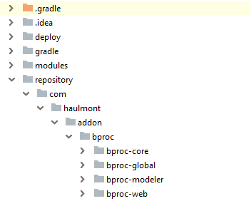
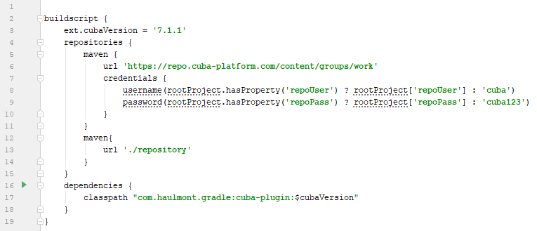

# BProc Sampler

The project contains [BProc](https://www.cuba-platform.com/marketplace/bproc/) addon usage examples. There are several processes deployed, that demonstrate different BProc addon features.

The *Application - Sampler* screen is opened by default after you log in to the application (the credentials are _admin/admin_). The screen allows you to read sample descriptions, view related source code and start the process.


## How to Include the BProc Trial Version

You can get trial subscription from [CUBA marketplace](https://www.cuba-platform.com/marketplace/bproc/) to run this application on your local environment. After getting trial subscription you'll receive an email with a link for downloading ZIP archive with artifacts.

To install the trial version of BProc add-on:

1. Get trial subscription from [CUBA Marketplace](https://www.cuba-platform.com/marketplace/bproc/). You'll get an email with a link and instructions.

2. Download ZIP archive with artifacts at link from the email.

3. Clone the repository of this demo project.

4. Open demo project in CUBA Studio.

5. Create a directory called `repository` in the root directory of the demo project.

6. Unzip the file with artifacts into this directory. You should get the following directory structure:

 

7. Open `build.gradle` file and register a new Maven repository.
 ```
maven {
    url './repository'
    }
```
 

8. Find a string with add-on coordinates and replace the add-on version with the latest one. Check the latest version on [CUBA Marketplace](https://www.cuba-platform.com/marketplace/bproc/).

 

9. Then add `.trial` to the end of add-on coordinates.

 

10. Go to *CUBA -> Build Tasks -> Deploy* to check that the add-on was installed successfully.   
